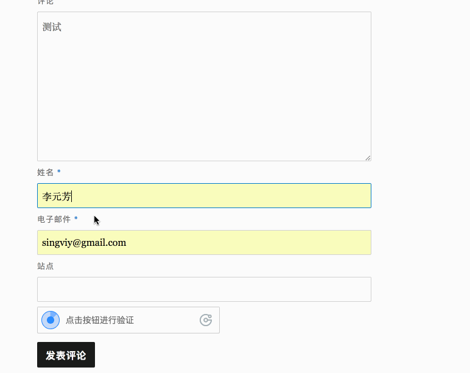

# wp-geetest@3.0

老版本的geetest的wordpress插件已经不能用了，主要原因是极验验证的接口从2.0升级到3.0的原因，
如果你也在wp博客中使用geetest，希望能帮到你。

## 使用方法：

    git clone git@github.com:Jaggle/wp-geetest-3.0.git /path/to/wordpress/plugins/dir
    
    
> 或者你用ftp上传也行
    

修改权限：

    chown -R [你web进程的用户] /path/to/wordpress/plugins/geetest

然后到wordpress后台`已安装的插件`页面启用后，填入你在[GEETEST 极验验证](http://www.geetest.com/)官网申请的id和key即可。

## 声明

本插件由[GEETEST 极验验证](http://www.geetest.com/)以GPL协议发布，本人仅对该插件做了
稍许修复。

    
